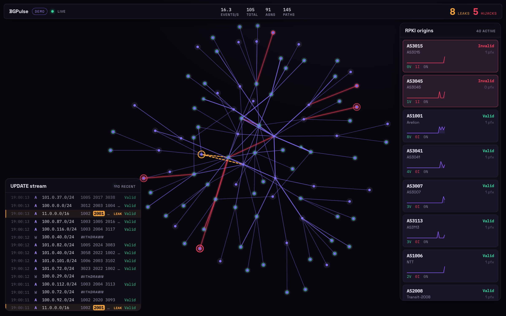
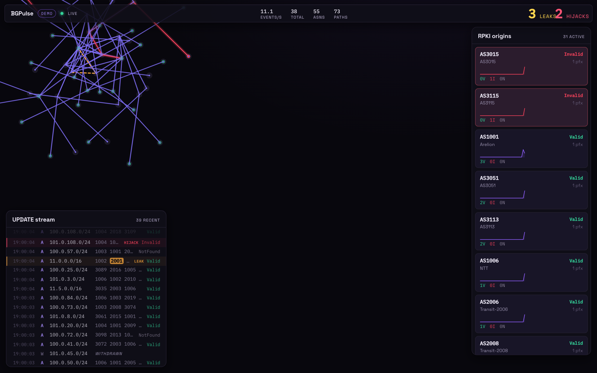
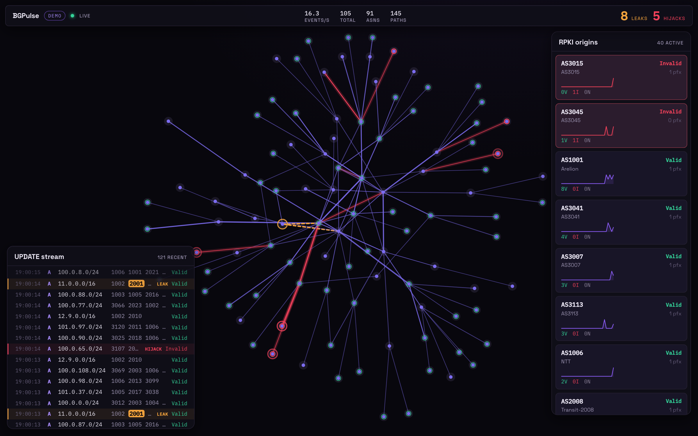
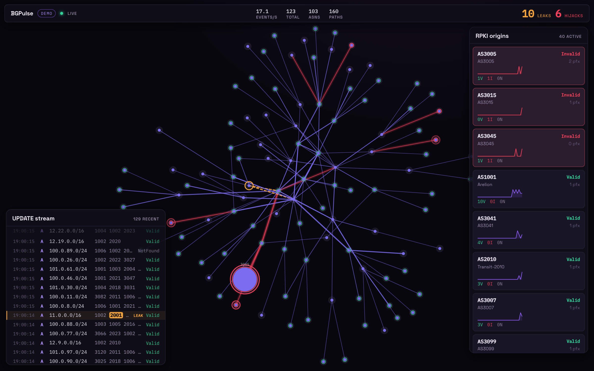
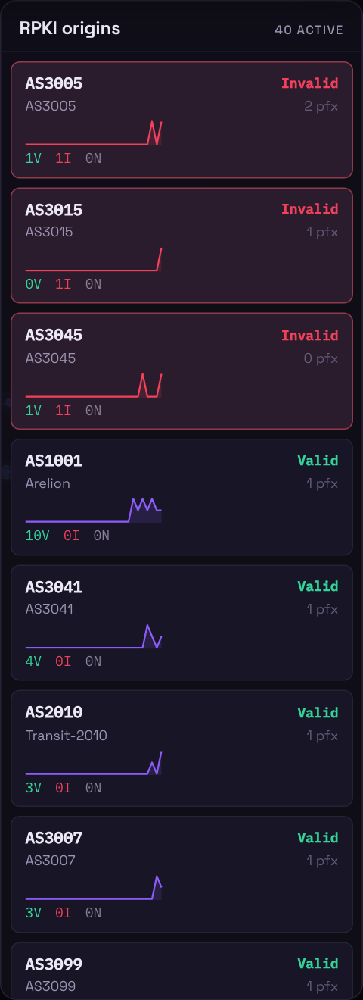
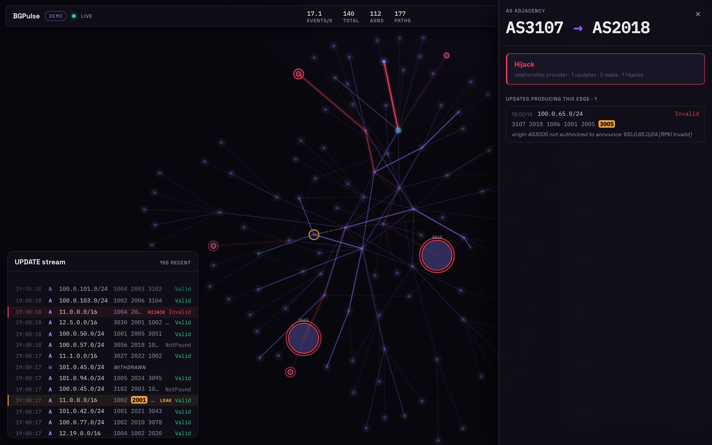
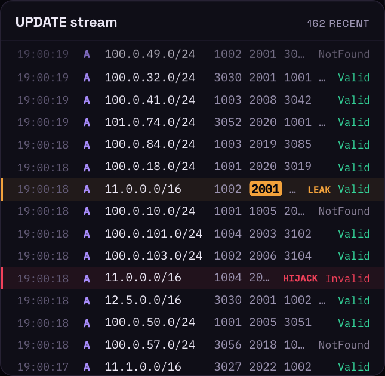

<h1 align="center">BGPulse</h1>

<p align="center">
  <strong>Live BGP route-leak and prefix-hijack detector with AS-path topology visualization.</strong>
</p>

<p align="center">
  
  
  
  
  
  
</p>

<p align="center">
  
</p>

---

## What it is

BGP route leaks and prefix hijacks — the failure mode behind the **Facebook 2021
outage** and repeated AWS/Cloudflare incidents — propagate across the internet for
minutes before operators notice, and most tooling gives no real-time visual signal
of *why* a route is wrong.

**BGPulse** ingests a stream of BGP `UPDATE`/`WITHDRAW` messages and runs two of the
algorithms at the heart of internet routing security against every announcement, in
real time:

- the **Gao-Rexford valley-free** model, to detect route **leaks** in the AS_PATH
  topology and pinpoint the offending AS, and
- **RFC 6811 RPKI Route Origin Validation**, to detect prefix **hijacks** at the
  origin (`Valid` / `Invalid` / `NotFound`).

The result is rendered as an interactive, force-directed **AS-path topology**: a
violet constellation of autonomous systems that ignites **amber** on a leak and
**crimson** on a hijack, the moment it propagates through the routing table.

It runs **fully offline out of the box** on a deterministic synthetic BGP stream that
injects real leaks and hijacks on a schedule, and it will also replay real
RouteViews / RIPE RIS **MRT dumps** and validate against a live **Routinator RTR**
session.

---

## Live walkthrough

Every screenshot below is captured from the running stack with real data (see
[`frontend/scripts/screenshots.mjs`](frontend/scripts/screenshots.mjs)), driven by
Playwright through the golden path.

**1 — Launch.** The observatory connects to the live stream; the backbone canvas is
empty for a beat before the first snapshot arrives.



**2 — Steady state.** The force-directed AS topology settles into a violet
constellation. Tier-1 ASes are large bright hubs; stubs are small leaves. Edges are
announcements; node halos are RPKI origins. The status bar tracks the live event
rate and the running leak/hijack counters.


**3 — A route leak fires.** A customer/peer re-announces a provider route where it
should not. The valley-free walk flags the leak, colours the offending edge **amber
(dashed)**, rings the offending AS, and the UPDATE-stream rail highlights the exact
offending hop in the AS_PATH.



**4 — A prefix hijack fires.** An AS announces a prefix it is not authorized to
originate. RPKI origin validation returns `Invalid`, the event is classified as a
hijack, and the bogus origin flares **crimson** with the hijack counter ticking.



**5 — RPKI sidebar.** Per-origin validation, `Invalid` first, each card carrying a
throughput sparkline and `Valid`/`Invalid`/`NotFound` tallies.



**6 — Drill down.** Clicking any edge opens the adjacency drawer: the valley-free and
RPKI verdict, plus the raw `UPDATE`s that produced the edge — here, the exact
`origin AS not authorized to announce …` explanation behind a hijack.



**7 — The UPDATE stream.** Every announcement and withdrawal, newest first, with the
AS_PATH, prefix, valley-free tag, and RPKI stamp.



---

## Architecture

```
 Source ── UpdateEvent ──▶ Classifier ── ClassifiedEvent ──▶ Aggregator ──▶ WebSocket Hub ──▶ React + D3 topology
 (synthetic     (chan,        (1 goroutine:        (chan)      (single-writer    (marshal once,
  generator      buf 1024)     Gao-Rexford                      actor: AS graph,   drop-oldest
  or MRT                       valley-free +                    RIB, event ring,   per client)
  replay)                      RFC 6811 RPKI)                   RPKI sparklines)
                                                                      ▲
                                              REST snapshot requests ─┘ (consistent value copies)
```

- **Backend (Go 1.26).** A streaming pipeline. The AS graph is owned by a single
  *actor* goroutine — every mutation arrives on one channel and every read arrives as
  a snapshot request, so the structure is **race-free by construction** (no mutex,
  `go test -race` clean). MRT/BGP wire decoding uses [gobgp](https://github.com/osrg/gobgp);
  the valley-free classifier, the RPKI trie, the RTR client, and the synthetic
  generator are all hand-rolled.
- **Frontend (React 19 + TypeScript + D3).** `d3-force` owns the layout math; a
  **Canvas 2D** renderer draws the whole graph in one pass per frame (no DOM churn at
  hundreds of nodes). React owns only the chrome. State lives in Zustand stores
  updated outside React's render cycle.
- **Transport.** A typed WebSocket pushes a full `snapshot` on connect, then per-event
  frames and periodic `stats`; every frame is validated with a zod schema at the
  boundary. The same JSON contract is pinned by a golden test on both sides.

The reconciled architecture and the design rationale live in
[`docs/ARCHITECTURE.md`](docs/ARCHITECTURE.md); the full specification is embedded in
[`CLAUDE.md`](CLAUDE.md).

---

## Technical deep-dive

**The Gao-Rexford valley-free walk.** A route is valley-free iff, read in the
direction of propagation (origin → collector), its inter-AS relationships match
`(c2p)* (p2p | p2c)? (p2c)*` — climb the customer cone, cross at most one peering
link, then descend. BGPulse implements this as a two-phase (`Up` → `Down`) state
machine: a customer→provider link in the `Down` phase, or a second peer link, is a
**valley**, and the AS where it occurs is reported as the offender. Sibling links are
phase-transparent; unknown and AS_SET-derived links are never flagged, so an
incomplete relationship dataset never produces a false leak.

**RFC 6811, done right.** The subtle part of origin validation is that *covering* is
pure prefix containment — `maxLength` is part of the *match* test, **not** the cover
test. A `/24` carved out of a `10.0.0.0/16`-maxLen-16 ROA is therefore **Invalid**,
not `NotFound`, even though nothing matches it. Getting this wrong silently misses
the entire more-specific-hijack class; BGPulse's VRP trie separates the two tests and
proves the boundary case in a table test.

**It runs offline, but the algorithms are real.** Pluggability lives only at the
data-source seam. In demo mode a seeded `math/rand/v2` generator builds **one**
canonical tiered AS topology and derives *both* the relationship store and the RPKI
VRP set from it, then injects reproducible leaks (a transit AS re-announcing a
provider route to another provider) and hijacks (a stub announcing someone else's
ROA'd prefix). An integration test runs that synthetic stream through the *real*
classifier and asserts the injected anomalies are detected with zero false positives
on the baseline.

**Real wire protocols.** The MRT parser decodes genuine RouteViews/RIPE `BGP4MP`
records (4-byte ASNs, AS_SET aggregation, IPv6 `MP_REACH`), and the **RFC 8210 RTR
client** implements the Reset/Serial-Query synchronization state machine with
incremental deltas — tested against an in-memory fake cache over `net.Pipe`.

---

## Install & run

### With Docker (one command)

```bash
docker compose up --build
# open http://localhost:8080
```

nginx serves the SPA and proxies `/api` and `/ws` to the Go backend.

### From source (dev)

```bash
# Terminal 1 — backend (demo mode, REST + WS on :8080)
cd backend
go run ./cmd/bgpulse -mode demo

# Terminal 2 — frontend (Vite dev server proxies /api and /ws to :8080)
cd frontend
npm install
npm run dev          # open the printed http://localhost:5173
```

### Tests

```bash
cd backend  && go test -race ./...      # unit + integration, race-clean
cd backend  && make cover               # core-logic coverage (>=80%)
cd frontend && npm test                 # vitest (schema/reducers/scales/format)
```

---

## Replay a real MRT dump

```bash
# Download an updates dump (RouteViews / RIPE RIS), then:
go run ./cmd/bgpulse -mode replay \
  -mrt-file updates.20240101.0000.bz2 \
  -asrel-file serial-2.as-rel.txt \      # CAIDA AS-relationship file (optional)
  -vrp-file vrps.json                    # Routinator/rpki-client export (optional)

# Or validate against a live RPKI cache instead of a VRP file:
go run ./cmd/bgpulse -mode replay -mrt-file updates.bz2 -rtr-addr rpki.example:8323
```

Without `-mrt-file`, replay mode loops a small bundled fixture so the path is
demonstrable offline.

## Configuration

Every flag has a `BGPULSE_`-prefixed env twin (flag > env > default):

| Flag | Default | Purpose |
|------|---------|---------|
| `-mode` | `demo` | `demo` (synthetic) or `replay` (MRT file) |
| `-listen` | `:8080` | HTTP listen address |
| `-mrt-file` | — | MRT dump to replay |
| `-asrel-file` | bundled | CAIDA AS-relationship file |
| `-vrp-file` | bundled | Routinator/rpki-client VRP JSON |
| `-rtr-addr` | — | live RTR cache `host:port` (overrides VRP file) |
| `-seed` | built-in | deterministic generator seed |
| `-static-dir` | — | serve a built frontend (single-binary mode) |

## Project layout

```
backend/   Go pipeline: bgp types · relationships · valleyfree · rpki · rtr ·
           mrt · synth · classify · topology (actor) · api · wshub · server
frontend/  React 19 + D3: lib (types/schema/reducers) · hooks (stores/ws) ·
           components (topology canvas, event rail, RPKI sidebar, drill-down)
docs/      ARCHITECTURE.md + live screenshots
```

## License

[MIT](LICENSE)
